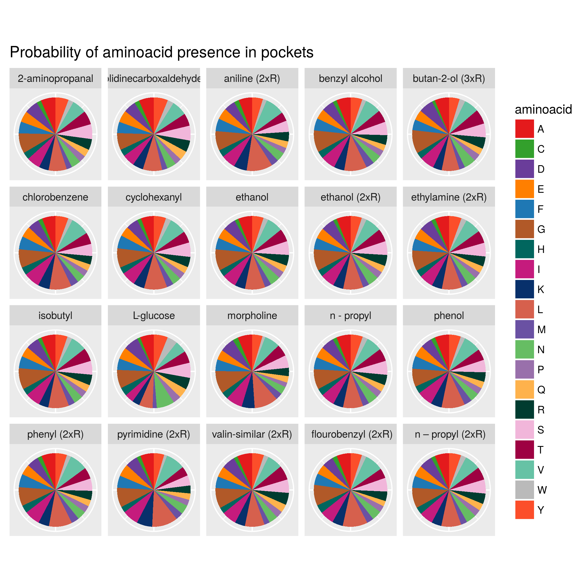
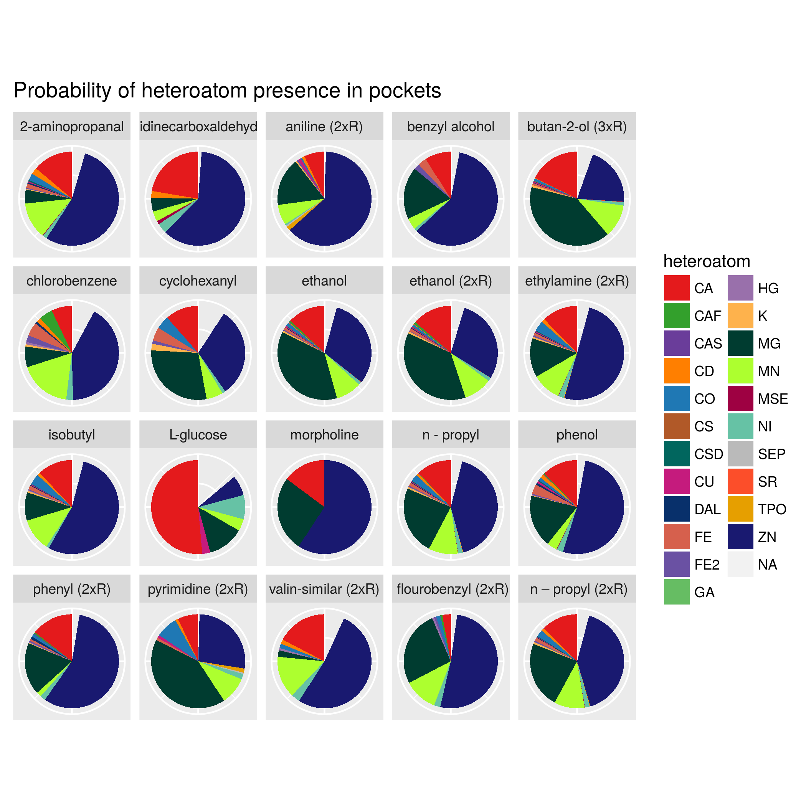

```{r setup, include=FALSE}
knitr::opts_chunk$set(echo = TRUE)
library(rCharts)
library(knitr)
opts_chunk$set(comment = NA, results = "asis", comment = NA, tidy = F)
```

```{r include=FALSE}
library(ggplot2)
library(rCharts)
library(scales)
library(tidyr)

inicjalizuj <- function(angs=3){
  #tu ustawiam folder w którym pracuję
  #musisz sobie tu wpisać swój folder ddgrupa4 mój wykomentuj
  #setwd("/home/joanna/Pulpit/Leki_projekt/ddgrupa4")
  folder<<-"/home/hania/ProjLek/ddgrupa4/"
  
  if(angs==3){
    folder<<-paste0(folder,"results/")
    #setwd("zones")
  } else
  {
    folder<<-paste0(folder,"results_5A/")
    #setwd("zones_5A")
  }
  
  #wiem że brzydko globalne, ale robie tu bo a) wygodnie, b) to nie na zaliczenie u Bieceła przeca.
  aa <<- read.csv(paste0(folder,'normalWynikiaa.csv'),sep=';')
  div_aa <<- read.csv(paste0(folder,'weightedWynikiaa.csv'),sep=';')
  min_aa <<- read.csv(paste0(folder,'weightedminusWynikiaa.csv'),sep=';')
  aaprobs <<- read.csv(paste0(folder,'all_groups.csv'),sep=',',header=FALSE)
  
  ion <<- read.csv(paste0(folder,'normalWynikiion.csv'),sep=';')
  div_ion <<- read.csv(paste0(folder,'weightedWynikiion.csv'),sep=';')
  min_ion <<- read.csv(paste0(folder,'weightedminusWynikiion.csv'),sep=';')
  ionprobs <<- read.csv(paste0(folder,'ions_all_group.csv'),sep=',',header=FALSE)
  
  #pytanie czy chcemy też dla grup zrobić wykresy dla ilu plików były
  #znalezione jakiekolwiek otoczenia/dla ilu nie?
}


porownaj_wagi <- function(angs=3){
  inicjalizuj(angs)
  
  for(i in 1:20){
    dane <- data.frame(aa[aa$grupa==i,2:21])
    rownames(dane) <- c("aa")
    dane["min_aa",] <- min_aa[min_aa$grupa==i,2:21]
    dane["div_aa",] <- div_aa[div_aa$grupa==i,2:21]
    dane["aaprobs",] <- t(aaprobs[aaprobs$V1==paste0("grupa",toString(1)),3])
    dane <- as.matrix(t(dane))
    #barplot(dane, beside=TRUE, col = c("blue","red","green"))
    barplot(rescale(dane[,"aa"]), col="blue",main = paste0("aa grupa",toString(i)))
    barplot(rescale(dane[,"min_aa"]), col="red",main = paste0("min_aa grupa",toString(i)))
    barplot(rescale(dane[,"div_aa"]), col="green",main = paste0("div_aa grupa",toString(i)))
    barplot(rescale(dane[,"aaprobs"]), col="yellow",main = paste0("aaprobs grupa",toString(i)))
  }
  #horiz = True?
}

przygotuj_i_zrob_ladniusie_wykresy <- function(angs=3){
  divaa <- data.frame(div_aa)
  divion <- data.frame(div_ion)
  for(i in 1:20){
    danea <- data.frame(div_aa[div_aa$grupa==i,2:21])
    divaa[i,2:21] <- rescale(as.matrix(danea))
    danei <- data.frame(div_ion[div_ion$grupa==i,2:24])
    divion[i,2:24] <- rescale(as.matrix(danei))
    
  
  }
  #trzeba robic gather po roznych grupach, wylaczajac nulle i robic osobne wykresiki
  
  #wszystkie
  wykresl_wszystkie(divaa,divion,angs)
  wykresl_grupami(divaa,divion,angs)
}
  
ciastki_aa <- function(angs=3){
  colnames(aaprobs) <<- c("grupa","aminoacid","probability")
  #Tu podmień na swoją ścieżkę do tego pliku z naszego repo (folder inputfiles)
  grupowanie <- as.data.frame(read.csv("~/ProjLek/ddgrupa4/inputfiles/grupy_przygototwane_1.csv"))
  aaprobab <- cbind(aaprobs,grupowanie)
  prawdopodobienstwa <- ggplot(data = aaprobab, aes(x="", y=probability, fill=aminoacid)) +
    geom_bar(width = 1, stat = "identity") +
    coord_polar("y", start=0) +
    facet_wrap("Name") +
    scale_fill_manual(
      values = c("A"="#e41a1c", "C"="#33a02c", "D"="#6a3d9a", "E"="#ff7f00", "F"="#1f78b4", "G"="#b15928", "H"="#01665e", "I"="#c51b7d", "K"="#08306b", "L"="#d6604d", "M"="#6a51a3", "N"="#66bd63", "P"="#9970ab", "Q"="#feb24c", "R"="#003c30", "S"="#f1b6da", "T"="#9e0142", "V"="#66c2a5", "W"="#bababa", "Y"="#fc4e2a")) +
    theme(axis.text.x=element_blank(), axis.title.x = element_blank(), axis.ticks.y = element_blank(), axis.text.y=element_blank(), axis.title.y = element_blank()) +
    ggtitle("Probability of aminoacid presence in pockets")
  pdf(file = paste0("ciastki_aa_",as.character(angs),".pdf"), paper = "a4")
  prawdopodobienstwa
  dev.off()
  ggsave(paste0("ciastki_aa_",as.character(angs),".pdf"), plot= prawdopodobienstwa, device = 'pdf')
  #grupa1 <- filter(aaprobs, grupa == "grupa1")
  #prawdopodobienstwa1 <- nPlot(prawdopodobienstwo ~ aminokwas, data = grupa1, type = 'pieChart')
  #prawdopodobienstwa1$chart(showLegend = FALSE)
  #prawdopodobienstwa1$templates$script <- "http://timelyportfolio.github.io/rCharts_nvd3_templates/chartWithTitle.html"
  #wszystkieaa$set(title = "Heteroatom occurence in ligand environment")
}

ciastki_ion <- function(angs=3){
  colnames(ionprobs) <- c("grupa","heteroatom","probability")
  #Tu podmień na swoją ścieżkę do tego pliku z naszego repo (folder inputfiles)
  grupowanie <- as.data.frame(read.csv("~/ProjLek/ddgrupa4/inputfiles/grupy_przygototwane_2.csv"))
  ionprobab <- cbind(ionprobs,grupowanie)
  prawdopodobienstwa <- ggplot(data = ionprobab, aes(x="", y=probability, fill=heteroatom)) +
    geom_bar(width = 1, stat = "identity") +
    coord_polar("y", start=0) +
    facet_wrap("Name") +
    scale_fill_manual(
      values = c("CA"="#e41a1c", "CAF"="#33a02c", "CAS"="#6a3d9a", "CD"="#ff7f00", "CO"="#1f78b4", "CS"="#b15928", "CSD"="#01665e", "CU"="#c51b7d", "DAL"="#08306b", "FE"="#d6604d", "FE2"="#6a51a3", "GA"="#66bd63", "HG"="#9970ab", "K"="#feb24c", "MG"="#003c30", "MC"="#f1b6da", "MSE"="#9e0142", "NI"="#66c2a5", "SEP"="#bababa", "SR"="#fc4e2a", "TPO"="#E69F00", "ZN"="#191970", "MN"="#ADFF2F", "NA"="#FF00FF")) +
    theme(axis.text.x=element_blank(), axis.title.x = element_blank(), axis.ticks.y = element_blank(), axis.text.y=element_blank(), axis.title.y = element_blank()) +
    ggtitle("Probability of heteroatom presence in pockets")
  ggsave(paste0("ciastki_ion_",as.character(angs),".pdf"), plot= prawdopodobienstwa, device = 'pdf')
  
  
}

#Tutaj jest funkcja, która robi dataframe o wielkości odpowiedniej dla
#zgatherowanych danych odpowiednio jonów lub aminokwasów.
#Można jej użyć bezpośrednio jako argumentu do cbind'a i wtedy będzie odpowiednia ramka danych.
dodaj_grupowanie <- function(angs = 3, dataset){
  #Podaj swoją ścieżkę!!!
  grupy <- as.data.frame(read.csv("~/ProjLek/ddgrupa4/inputfiles/podzial_grup.csv"))
  if(dataset == "aa"){
    grupy <- rbind(grupy,grupy,grupy,grupy,grupy,grupy,grupy,grupy,grupy,grupy,grupy,grupy,grupy,grupy,grupy,grupy,grupy,grupy,grupy,grupy)
  }
  if(dataset == "ion"){
    grupy <- rbind(grupy,grupy,grupy,grupy,grupy,grupy,grupy,grupy,grupy,grupy,grupy,grupy,grupy,grupy,grupy,grupy,grupy,grupy,grupy,grupy,grupy,grupy,grupy)
  }
  return(grupy)
}

wykresl_wszystkie <- function(divaa,divion,angs=3){
  divaa <- gather(divaa, 'aminokwas','wartosc', -grupa)
  divaa <- cbind(divaa,dodaj_grupowanie(angs,"aa"))
  wszystkieaa <- nPlot(wartosc ~ aminokwas, group = 'Name', data = divaa, type = 'multiBarChart')
  wszystkieaa$chart(stacked = TRUE)
  wszystkieaa$xAxis(axisLabel = "aminoacid")
  wszystkieaa$templates$script <- "http://timelyportfolio.github.io/rCharts_nvd3_templates/chartWithTitle.html"
  wszystkieaa$set(title = "Aminoacid occurence in ligand environment")
  wszystkieaa$save(paste0(folder,"plots/",toString(angs),'_wszystkieaa.html'), standalone = TRUE)
  
  divion <- gather(divion, 'heteroatom','wartosc', -grupa)
  divion <- cbind(divion,dodaj_grupowanie(angs,"ion"))
  wszystkieion <- nPlot(wartosc ~ heteroatom, group = 'Name', data = divion, type = 'multiBarChart')
   wszystkieion$chart(stacked = TRUE)
  wszystkieion$xAxis( axisLabel = "heteroatom")
  wszystkieion$templates$script <- "http://timelyportfolio.github.io/rCharts_nvd3_templates/chartWithTitle.html"
  wszystkieion$set(title = "Heteroatom occurence in ligand environment")
  wszystkieion$save(paste0(folder,"plots/",toString(angs),'_wszystkieion.html'), standalone = TRUE)
}

wykresl_grupami <- function(divaa,divion,angs = 3){
  
  divaa <- gather(divaa, 'aminokwas','wartosc', -grupa)
  divaa <- cbind(divaa,dodaj_grupowanie(angs,"aa"))
  for(x in colnames(divaa)[6:12]){
    for (typ in as.character(unique(divaa[x])[,1])){
  wszystkieaa <- nPlot(wartosc ~ aminokwas, group = 'Name', data = divaa[divaa[x]==typ,], type = 'multiBarChart')
   wszystkieaa$chart(stacked = TRUE)
  wszystkieaa$xAxis(axisLabel = "aminoacid")
  wszystkieaa$templates$script <- "http://timelyportfolio.github.io/rCharts_nvd3_templates/chartWithTitle.html"
  wszystkieaa$set(title = "Aminoacid occurence in ligand environment")
  wszystkieaa$save(paste0(folder,"plots/",toString(angs),typ,'_aa.html'), standalone = TRUE)
    }}
  
  divion <- gather(divion, 'heteroatom','wartosc', -grupa)
  divion <- cbind(divion,dodaj_grupowanie(angs,"ion"))
  for(x in colnames(divion)[6:12]){
    for (typ in as.character(unique(divion[x])[,1])){
  wszystkieion <- nPlot(wartosc ~ heteroatom, group = 'Name', data = divion[divion[x]==typ,], type = 'multiBarChart')
   wszystkieion$chart(stacked = TRUE)
  wszystkieion$xAxis( axisLabel = "heteroatom")
  wszystkieion$templates$script <- "http://timelyportfolio.github.io/rCharts_nvd3_templates/chartWithTitle.html"
  wszystkieion$set(title = "Heteroatom occurence in ligand environment")
  wszystkieion$save(paste0(folder,"plots/",toString(angs),typ,'_ion.html'), standalone = TRUE)
  }
  }
}

```

```{r cache=F, include=FALSE}
#inicjalizuj()
#przygotuj_i_zrob_ladniusie_wykresy()
#inicjalizuj(5)
#przygotuj_i_zrob_ladniusie_wykresy(5)

```
Ciastki - prawdopodobieństwa wystąpienia w kieszeni aktywnej dla danej grupy:  
3A, aminokwasy  

  
5A, aminokwasy  

  

3A, heteroatomy  

5A, heteroatomy  

  

Wszystkie grupy - aminokwasy, 3A: D,K,N,Q,R,Y  
<iframe src="../results/plots/3_wszystkieaa.html" align="center" width="900" height="500" frameBorder="0"></iframe>  
i 5A: zdecydowanie przeważają W i Y  
<iframe src="../results_5A/plots/5_wszystkieaa.html" align="center" width="900" height="500" frameBorder="0"></iframe>  

Ciekawa jest tutaj ta wyraźna różnica w najczęściej występujących aminokwasach. Widać, że rozszerzenie zakresu sporo potrafi zmienić.  

Wszystkie grupy - jony, 3A: CA, CU, FE, ZN  
<iframe src="../results/plots/3_wszystkieion.html" align="center" width="900" height="500" frameBorder="0"></iframe>  
i 5A: CU, FE, MN, MSE, ZN  
<iframe src="../results_5A/plots/5_wszystkieion.html" align="center" width="900" height="500" frameBorder="0"></iframe>  

W większym otoczeniu mamy dużo większą różnorodność jonów (czego można się spodziewać).  

Jak widać patrzyliśmy też na jony, ale ponieważ nie wynieśliśmy z nich zbyt wiele ciekawych informacji w większości w dalszych analizach pomijamy je.  


3A i ALKOHOLE: R, K  
<iframe src="../results/plots/3alcohol_aa.html" align="center" width="900" height="500" frameBorder="0"></iframe>  

Grupy z grupą hydroksylową (alkohole) preferują dodatnio naładowane otoczenie.  

5A i ALKOHOLE:  W, R, Y  
<iframe src="../results_5A/plots/5alcohol_aa.html" align="center" width="900" height="500" frameBorder="0"></iframe>  

Dwa polarne i jeden dodatnio naładowany - podejrzenie, że aminokwas polarny odwraca się odpowiednią stronę.  

TU DODAĆ NAŁADOWANE, SKORO JEST PODOBNIE

3A i AROMATYCZNE: D, N, R, Q  
<iframe src="../results/plots/3aromatic_aa.html" align="center" width="900" height="500" frameBorder="0"></iframe>  

Wszystkie polarne, blisko jest tylko jeden aminokwas aromatyczny (Y).  
Nie można stwierdzić występowania stackingu - brak wpływu grupy aromatycznej na otoczenie aminokwasowe.  

5A i AROMATYCZNE: F,L,M,W,Y  
<iframe src="../results_5A/plots/5aromatic_aa.html" align="center" width="900" height="500" frameBorder="0"></iframe>  

4 niepolarne; 3 aminokwasy aromatyczne.  
Przeciwny wniosek: istnieje szansa występowania stackingu. Co więcej, otoczenie jest hydrofobowo-aromatyczne. Stacking występuje na większe odległości, preferuje też bycie "niezbyt blisko" dwóch pierścieni, więc można stwierdzić że jak najbardziej to zjawisko występuje tu.  

Widać że rozszerzenie oglądanego otoczenia może sporo zmienić.  


HYDROFOBOWE/HYDROFILOWE!!!
